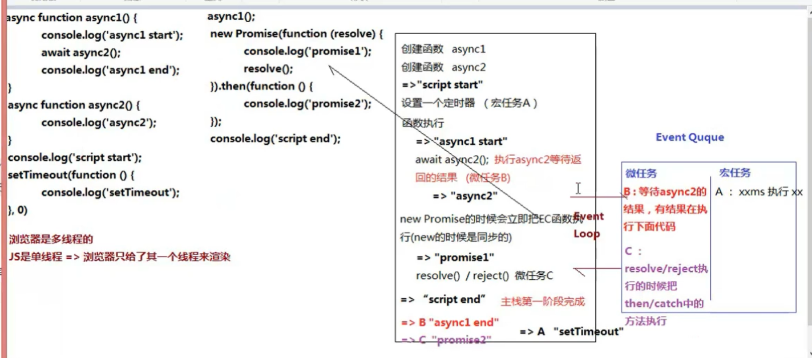

# 高阶题

## 第一类 基础

```javascript
// ①
var obj1 = {};
var a1 = "0";
var b1 = 0;
obj1[a1] = "小";
obj1[b1] = "大";
console.log(obj1[a1]); // => 大	数字类型的属性会进行类型转换

// ②
var obj2 = {};
var a2 = Symbol(1);
var b2 = Symbol(1);
obj2[a2] = "小";
obj2[b2] = "大";
console.log(obj2[a2]); // => 小	Symbol是唯一值

// ③
var obj3 = {};
var a3 = { name: "123" };
var b3 = { age: "456" };
obj3[a3] = "小";
obj3[b3] = "大";
console.log(obj3[a3]); // => 大	引用类型作为属性会调用 valueOf() / toString() 方法

```

## 第二类 闭包

```javascript
// ①
var test = (function(i) {
	return function() {
		alert((i *= 4)); // => 字符串 "12"
		alert({}); // => 字符串 "[object Object]"
	};
})(3);

test(6);


		 // ②
		 var x = 0;
      var y = 1;
      function fn() {
        x += 2;
        fn = function(y) {
          console.log(y + --x);
        };
        console.log(x, y);
      }
      fn(3);
      fn(4);
      console.log(x, y);

		 // ③
		 var x = 2;
      var y = {
        x: 3,
        z: (function(x) {
          this.x *= x;
          return function(n) {
            this.x *= n;
            x += 3;
            console.log(x);
          };
        })(x),
      };
      var m = y.z;
      m(4);
      y.z(5);
      console.log(x, y.x);
```


## 第三类

```javascript
var va = 0;
var vb = 0;
function A(va) {
	A = function(vb) {
		alert(va + vb++);
	};
	alert(va++);
}

A(1); // => "1"
A(2); // => "4"
```


## 第四类 克隆

```javascript
		var obj = {
        a: 100,
        b: [10, 20, 30],
        c: {
          x: 111,
        },
        d: /^\d+$/,
        e: function() {
          console.log(1);
        },
      };

      var arr = [
        10,
        [100, 200],
        {
          x: 10,
          y: 20,
        },
      ];

      // 浅克隆，但会忽略null、函数、正则、日期
      var cloneObj = JSON.parse(JSON.stringify(obj));

      // 浅克隆，引用类型的数据仍然指向的是同一个
      var newObj = {};
      for (const key in obj) {
        if (obj.hasOwnProperty(key)) {
          newObj[key] = obj[key];
        }
      }
      newObj.c.x = 222; // => obj.c.x 也变成了222

      /* 
        深克隆
        @params{ deep: boolean } true 则为深克隆
       */
      function clone(data, deep) {
        var copy = new data.constructor();
        if (deep) {
          if (data === null) return null;
          if (typeof data !== "object") return data;
          if (data instanceof RegExp) return new RegExp(data);
          if (data instanceof Date) return new Date(data);
          for (const key in data) {
            if (data.hasOwnProperty(key)) {
              copy[key] = clone(data[key], deep);
            }
          }
        }
        return copy;
      }
```

## 第五类 符号优先级 + 变量提升机制

```javascript
		// https://developer.mozilla.org/zh-CN/docs/Web/JavaScript/Reference/Operators/Operator_Precedence
		// ①
      function Foo() {
        getName = function() {
          console.log(1);
        };
        return this;
      }

      Foo.getName = function() {
        console.log(2);
      };

      Foo.prototype.getName = function() {
        console.log(3);
      };

      var getName = function() {
        console.log(4);
      };

      function getName() {
        console.log(5);
      }

      Foo.getName(); // => 2
      getName(); // => 4
      Foo().getName(); // => 1
      getName(); // => 1
      new Foo.getName(); // => 2
      new Foo().getName(); // => 3
      new new Foo().getName(); // => 3

		// ②
		function A() {
        console.log(1);
      }

      function Func() {
        A = function() {
          console.log(2);
        };
        return this;
      }

      Func.A = A;

      Func.prototype = {
        A: () => {
          console.log(3);
        },
      };
      A(); // => 1
      Func.A(); // => 1
      Func().A(); // => 2
      new Func.A(); // => 1
      new Func().A(); // => 3
      new new Func().A(); // => 报错 箭头函数不可实例化 没有原型 没有constructor
```


## 第六类 事件循环机制 Event Loop

```javascript
		// ①
		async function async1() {
        console.log("async1 start"); // => step2
        await async2();
        console.log("async1 end"); // => step6
      }

      async function async2() {
        console.log("async2"); // => step3
      }

      console.log("script start"); // => step1

      setTimeout(function() {
        console.log("setTimeout"); // => step8
      }, 0);

      async1();

      new Promise(function(resolve) {
        console.log("Promise1"); // => step4
        resolve();
      }).then(function() {
        console.log("Promise2"); // => step7
      });

      console.log("script end"); // => step5
		
		// ②
		setTimeout(() => {
        console.log(1);
      }, 20);

      console.log(2);

      setTimeout(() => {
        console.log(3);
      }, 10);

      console.log(4);

      console.time("AA");

      for (let i = 0; i < 90000000; i++) {}

      console.timeEnd("AA");

      console.log(5);

      setTimeout(() => {
        console.log(6);
      }, 8);

      console.log(7);

      setTimeout(() => {
        console.log(8);
      }, 15);

      console.log(9);

		// ③
		console.log(1); // => step1

      setTimeout(() => {
        console.log(2); // => step10
      }, 1000); // => 添加到宏任务：T1

      async function fn() {
        console.log(3); // => step3

        setTimeout(() => {
          console.log(4); // => step6
        }, 20); // => 添加到宏任务：T2

        return Promise.resolve(); // => 静态方法，直接reject态
      }

      async function run() {
        console.log(5); // => step2
        await fn(); // fn()先执行后，这个await添加到微任务：M1
        console.log(6); // => 此处由于上一个Promise处于失败态，所以不会执行
      }

      run();

      // 需要执行150ms左右 => 接着到这(step3后)，当循环完毕的，T2就绪执行。T1还要好久
      for (let i = 0; i < 90000000; i++) {}

      setTimeout(() => {
        console.log(7); // => step7
        new Promise(resolve => {
          console.log(8); // => step8
          resolve(); // => 微任务：M2
        }).then(() => {
          console.log(9); // => step9
        });
      }, 0); // => 添加到宏任务：T3

      console.log(10); // => step4
```



## 第七类 高阶数组去重


## 第八类 类型转换

```javascript
		// var a; // => 当a为多少时 能进入判断
      var a = {
        i: 1,
        toString: function() {
          if (this.i === 1) {
            this.i++;
            return 1;
          } else if (this.i === 2) {
            this.i++;
            return 2;
          } else {
            return 3;
          }
        },
      };
      // 双等号会将 a 进行类型转换
      // 如果 a 是对象首先会先调用对象的 valueOf() 方法，如果没有则调用 toString() 方法
      // 三等号是严格等，不会进行类型转换
      if (a == 1 && (a == 2) & (a == 3)) {
        console.log(a);
      }
```

